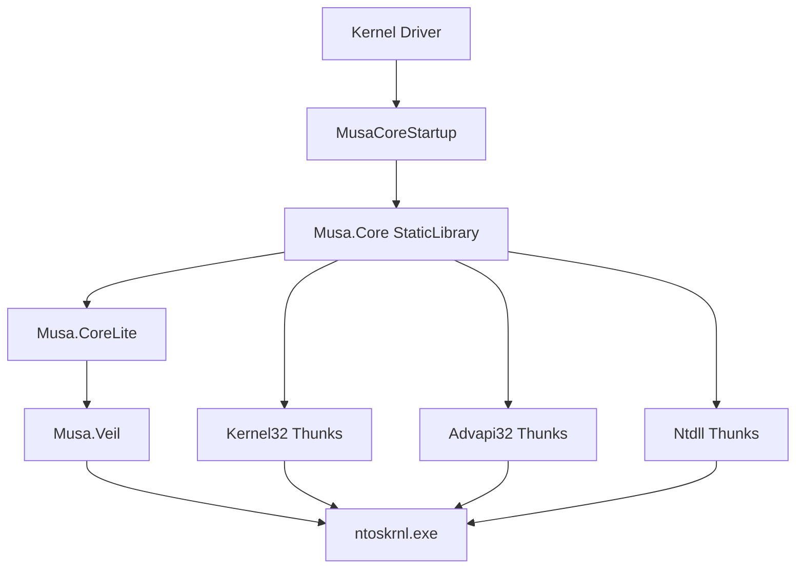

# [Musa.Core](https://github.com/MiroKaku/Musa.Core)

[](https://github.com/MiroKaku/Musa.Core/actions)
[](https://www.nuget.org/packages/Musa.Core/)
[](https://github.com/MiroKaku/Musa.Core/blob/main/LICENSE)


* [简体中文](./README.zh-CN.md)

## Overview

> **Warning**
>
> Musa.Core is in beta.

Musa.Core is a derivative of the low-level API implementation from [Musa.Runtime](https://github.com/MiroKaku/Musa.Runtime) (formerly [ucxxrt](https://github.com/MiroKaku/ucxxrt)). It reimplements Kernel32, Advapi32, and other Win32 APIs on top of ntoskrnl in kernel mode.

## Architecture



## Quick Start

### NuGet Install

```xml
<ItemGroup>
  <PackageReference Include="Musa.Core">
    <Version>1.1.1</Version>
  </PackageReference>
</ItemGroup>
```

The NuGet package depends on [Musa.CoreLite](https://github.com/MiroKaku/Musa.CoreLite). You can directly include `<Veil.h>` to access underlying APIs.

### DriverEntry Example

```c
NTSTATUS DriverEntry(PDRIVER_OBJECT DriverObject, PUNICODE_STRING RegistryPath)
{
    NTSTATUS Status = MusaCoreStartup(DriverObject, RegistryPath, FALSE);
    if (!NT_SUCCESS(Status)) return Status;

    // Kernel32/Advapi32 APIs now available
    WCHAR Dir[MAX_PATH];
    DWORD Len = GetCurrentDirectoryW(MAX_PATH, Dir);

    return Status;
}
```

### Build Requirements

| Dependency | Minimum Version |
|---|---|
| Visual Studio 2022 | 17.10+ |
| Windows Driver Kit (WDK) | Matching SDK build |
| Mile.Project.Configurations | 1.0.1917 |

### Building from Source

```cmd
.\BuildAllTargets.cmd
```

Build artifacts are output to the `Publish/` directory.

## Implemented Modules

| Module | Status |
|---|---|
| Zw Routines | ✅ All available |
| Rtl Series API | ✅ Partial |
| KernelBase API | ✅ Partial |
| Kernel32 Thunks (Phase 1-6) | ✅ Implemented |
| Advapi32 API | 🚧 In Progress |

## Key Features

- **Kernel-mode only** — exclusively supports KernelMode toolset projects; enforced at consumer build time
- **NuGet integration** — auto-configures header and library paths, injects `/INTEGRITYCHECK` linker flag
- **Debug logging** — `MusaLOG` macro outputs `DbgPrintEx` in Debug builds, no-op in Release

## Documentation

- [System Architecture](./docs/system-architecture.md) — component relationships, data flow, service dependencies
- [Deployment Guide](./docs/deployment-guide.md) — CI/CD pipeline and NuGet publishing
- [Configuration Guide](./docs/configuration-guide.md) — complete build configuration reference
- [Changelog](./docs/changelog.md) — version history

## License

[MIT License](./LICENSE)

## References

- [systeminformer](https://github.com/winsiderss/systeminformer)/phnt
- [Windows_OS_Internals_Curriculum_Resource_Kit-ACADEMIC](https://github.com/MeeSong/Windows_OS_Internals_Curriculum_Resource_Kit-ACADEMIC)
- Zw routine resolution approach provided by @[xiaobfly](https://github.com/xiaobfly)
