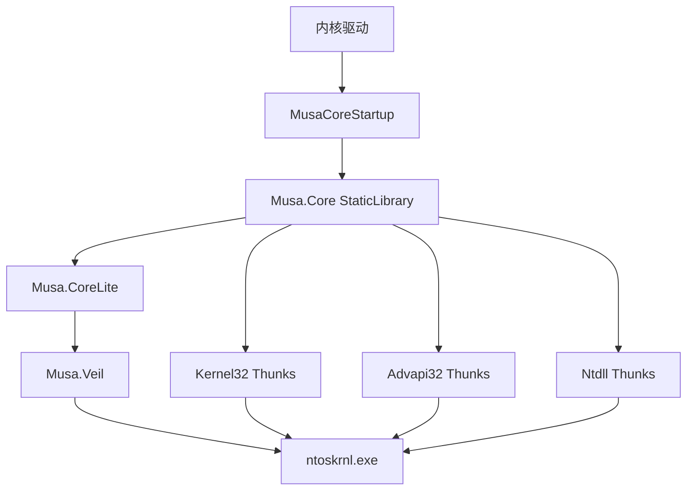

# [Musa.Core](https://github.com/MiroKaku/Musa.Core)

[](https://github.com/MiroKaku/Musa.Core/actions)
[](https://www.nuget.org/packages/Musa.Core/)
[](https://github.com/MiroKaku/Musa.Core/blob/main/LICENSE)


* [English](https://github.com/MiroKaku/Musa.Core/blob/main/README.md)

## 简介

> **Warning**
>
> Musa.Core 处于 beta 测试阶段。

Musa.Core 是 [Musa.Runtime](https://github.com/MiroKaku/Musa.Runtime)（原 [ucxxrt](https://github.com/MiroKaku/ucxxrt)）底层 API 实现的衍生物，使用 ntoskrnl 在内核态重新实现 Kernel32、Advapi32 等 Win32 API。

## 架构概览



## 快速开始

### NuGet 安装

```xml
<ItemGroup>
  <PackageReference Include="Musa.Core">
    <Version>1.1.1</Version>
  </PackageReference>
</ItemGroup>
```

NuGet 包依赖 [Musa.CoreLite](https://github.com/MiroKaku/Musa.CoreLite)，可直接包含 `<Veil.h>` 使用底层 API。

### 仅头文件模式

在你的 `.vcxproj` 文件里面添加下面代码：

```xml
<PropertyGroup>
  <MusaCoreOnlyHeader>true</MusaCoreOnlyHeader>
</PropertyGroup>
```

这个模式不会自动引入 lib 文件。

### DriverEntry 示例

```c
NTSTATUS DriverEntry(PDRIVER_OBJECT DriverObject, PUNICODE_STRING RegistryPath)
{
    NTSTATUS Status = MusaCoreStartup(DriverObject, RegistryPath, FALSE);
    if (!NT_SUCCESS(Status)) return Status;

    // 现在可以使用 Kernel32/Advapi32 API
    WCHAR Dir[MAX_PATH];
    DWORD Len = GetCurrentDirectoryW(MAX_PATH, Dir);

    return Status;
}
```

### 构建要求

| 依赖 | 最低版本 |
|---|---|
| Visual Studio 2022 | 17.10+ |
| Windows Driver Kit (WDK) | 匹配 SDK build |
| Mile.Project.Configurations | 1.0.1917 |

### 从源码构建

```cmd
.\BuildAllTargets.cmd
```

构建产物输出至 `Publish/` 目录。

## 已实现模块

| 模块 | 状态 |
|---|---|
| Zw 例程 | ✅ 全部可用 |
| Rtl 系列 API | ✅ 部分实现 |
| KernelBase API | ✅ 部分实现 |
| Kernel32 Thunks (Phase 1-6) | ✅ 已实现 |
| Advapi32 API | 🚧 进行中 |

## 关键特性

- **内核模式专属** — 仅支持 KernelMode 工具集项目，消费方构建时自动校验
- **NuGet 集成** — 自动配置头文件和库路径，注入 `/INTEGRITYCHECK` 链接器标志
- **调试日志** — `MusaLOG` 宏在 Debug 模式输出 `DbgPrintEx`，Release 空操作

## 文档

- [系统架构](./docs/system-architecture.md) — 组件关系、数据流、服务依赖
- [部署指南](./docs/deployment-guide.md) — CI/CD 流水线与 NuGet 发布
- [构建配置](./docs/configuration-guide.md) — 完整构建配置参考
- [变更日志](./docs/changelog.md) — 版本更新历史

## 许可

[MIT License](./LICENSE)

## 参考 & 感谢

- Zw 例程获取方案由 @[xiaobfly](https://github.com/xiaobfly) 提供
- 参考：[systeminformer](https://github.com/winsiderss/systeminformer)/phnt
- 参考：[Windows_OS_Internals_Curriculum_Resource_Kit-ACADEMIC](https://github.com/MeeSong/Windows_OS_Internals_Curriculum_Resource_Kit-ACADEMIC)
