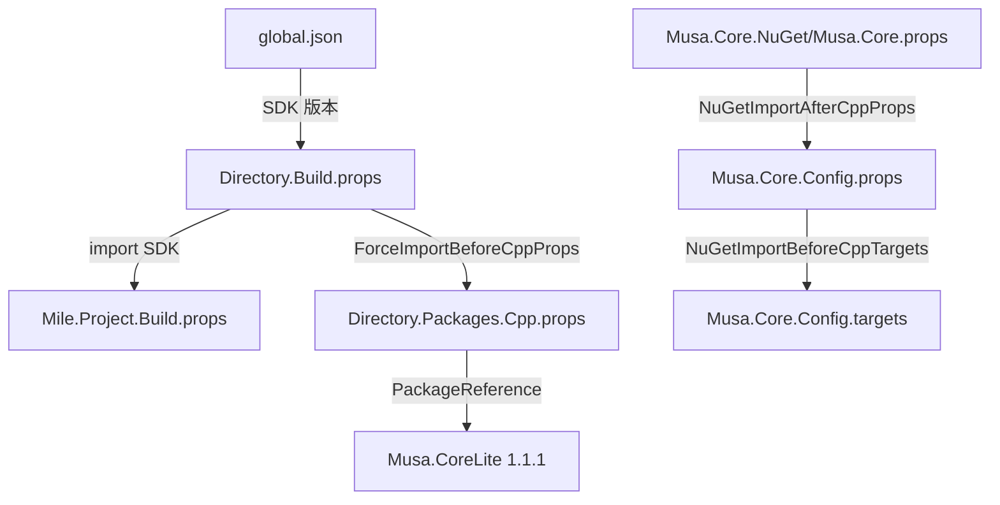

# 构建配置参考

> [系统架构](./system-architecture.md) ｜ [部署指南](./deployment-guide.md) ｜ [变更日志](./changelog.md)

## 概览

Musa.Core 使用 MSBuild SDK 驱动的构建系统，基于 `Mile.Project.Configurations` v1.0.1917。所有配置通过 props/targets 文件集中管理。

### 配置文件关系图



## 核心配置文件

### global.json

MSBuild SDK 版本锁定：

```json
{
  "msbuild-sdks": {
    "Mile.Project.Configurations": "1.0.1917"
  }
}
```

### Directory.Build.props

根级别构建属性，定义目录路径和导入链：

| 属性 | 值 | 说明 |
|---|---|---|
| `SourcesDirectory` | `$(MSBuildThisFileDirectory)Musa.Core\` | 源码根目录 |
| `PublishDirectory` | `$(MSBuildThisFileDirectory)Publish\` | 输出发布目录 |
| `MileProjectOutputPath` | `$(MSBuildThisFileDirectory)Output\` | 中间输出目录 |

关键行为：

- 导入 `Mile.Project.Configurations` SDK 的 `Mile.Project.Build.props`
- 将 repo 根目录和项目目录注入 `AdditionalIncludeDirectories`
- 通过 `ForceImportBeforeCppProps` 强制导入 `Directory.Packages.Cpp.props`

```xml
<Import Sdk="Mile.Project.Configurations" Project="Mile.Project.Build.props" />

<ItemDefinitionGroup>
  <ClCompile>
    <AdditionalIncludeDirectories>
      $(MSBuildThisFileDirectory);$(MSBuildProjectDirectory);%(AdditionalIncludeDirectories)
    </AdditionalIncludeDirectories>
  </ClCompile>
</ItemDefinitionGroup>
```

### Directory.Packages.Cpp.props

集中包管理（Central Package Management）：

```xml
<ItemGroup>
  <PackageReference Include="Musa.CoreLite" Version="1.1.1" />
</ItemGroup>
```

当前仅管理一个依赖：`Musa.CoreLite` v1.1.1。

### .editorconfig

编辑器与格式化规则：

| 文件类型 | 编码 | 缩进 | 行尾 | 其他 |
|---|---|---|---|---|
| 全局 | UTF-8-BOM | — | CRLF | — |
| C/C++ | UTF-8-BOM | 4 空格 | CRLF | Doxygen `/** */`，trim 尾空格 |
| C# / VB | UTF-8-BOM | 4 空格 | CRLF | trim 尾空格 |
| XML/JSON/TOML/XAML | UTF-8-BOM | 2 空格 | CRLF | trim 尾空格 |
| .rc / .inf / .bat | UTF-16LE | — | CRLF | — |
| .sh | UTF-8 | 4 空格 | LF | — |
| .asm / .inc / .nasm | UTF-8 | 4 空格 | CRLF | trim 尾空格 |

### exclusion.txt

排除跟踪的文件模式：

```
.lastcodeanalysissucceeded
.objs
```

## NuGet 消费方配置

### Musa.Core.props

入口文件，通过 NuGet 的 `NuGetImportAfterCppProps` / `NuGetImportBeforeCppTargets` 机制导入 Config 文件：

```xml
<PropertyGroup>
  <NuGetImportAfterCppProps>
    $(NuGetImportAfterCppProps);$(MSBuildThisFileDirectory)Config\Musa.Core.Config.props
  </NuGetImportAfterCppProps>
  <NuGetImportBeforeCppTargets>
    $(NuGetImportBeforeCppTargets);$(MSBuildThisFileDirectory)Config\Musa.Core.Config.targets
  </NuGetImportBeforeCppTargets>
</PropertyGroup>
```

### Musa.Core.Config.props

路径解析与编译设置：

1. **检测内核模式工具集** — `IsKernelModeToolset` 根据 `PlatformToolset` 是否包含 `KernelMode` 判断
2. **计算包根目录** — `Musa_Core_Root` 解析到 props 文件的上级目录
3. **设置路径** — `IncludePath` 和 `LibraryPath` 分别指向 `Include/` 和 `Library/$(Configuration)/$(Platform)`

```xml
<PropertyGroup Condition="'$(IsKernelModeToolset)'==''">
  <IsKernelModeToolset Condition="'$(PlatformToolset.Contains(`KernelMode`))' == 'true'">true</IsKernelModeToolset>
</PropertyGroup>

<PropertyGroup>
  <Musa_Core_Root>$([System.IO.Path]::GetFullPath('$(MSBuildThisFileDirectory)\..'))</Musa_Core_Root>
  <Musa_Core_Include>$(Musa_Core_Root)\Include</Musa_Core_Include>
  <Musa_Core_Library>$(Musa_Core_Root)\Library\$(Configuration)\$(Platform)</Musa_Core_Library>
  <IncludePath>$(Musa_Core_Include);$(IncludePath)</IncludePath>
  <LibraryPath>$(Musa_Core_Library);$(LibraryPath)</LibraryPath>
</PropertyGroup>
```

### Musa.Core.Config.targets

消费方构建时校验和链接器注入：

1. **内核模式校验** — 非 kernel-mode 且非仅头文件模式时编译报错
2. **链接器标志** — 添加 `/INTEGRITYCHECK`（内核驱动完整性校验必需）
3. **库依赖** — `Musa.Core.StaticLibraryForDriver.lib` + `Cng.lib`

```xml
<Target Name="_MusaCore_ValidateKernelMode" BeforeTargets="ClCompile">
  <Error Condition="'$(MusaCoreOnlyHeader)' != 'true' And '$(IsKernelModeToolset)' != 'true'"
         Text="Musa.Core is a kernel-mode only library..." />
</Target>

<ItemDefinitionGroup Condition="('$(MusaCoreOnlyHeader)'=='') Or ('$(MusaCoreOnlyHeader)'=='false')">
  <Link Condition="'$(IsKernelModeToolset)'=='true'">
    <AdditionalOptions>/INTEGRITYCHECK %(AdditionalOptions)</AdditionalOptions>
    <AdditionalDependencies>Musa.Core.StaticLibraryForDriver.lib;Cng.lib;%(AdditionalDependencies)</AdditionalDependencies>
  </Link>
</ItemDefinitionGroup>
```

## 预编译头文件（PCH）

### universal.h

位于 `Musa.Core.StaticLibraryForDriver/universal.h`，所有编译单元通过 `Musa.Core.Nothing.cpp` 强制包含。

**宏定义：**

| 宏 | 值 | 用途 |
|---|---|---|
| `POOL_NX_OPTIN` | `1` | 启用 NX 非分页池 |
| `POOL_ZERO_DOWN_LEVEL_SUPPORT` | `1` | 零初始化池支持 |
| `RTL_USE_AVL_TABLES` | — | AVL 表 API |
| `_KERNEL_MODE` | `1` | 强制内核模式（修复 ReSharper 分析） |

**包含链：**

1. `Veil.h` — 底层系统头封装
2. `stddef.h`, `stdlib.h`, `string.h` — C 标准库
3. `Musa.CoreLite.h` — CoreLite 公共接口
4. `Musa.Core/Musa.Core.h` — Musa.Core 公开接口

**全局宏：**

```c
constexpr unsigned long MUSA_TAG = '-iM-';          // 池标记
#define MUSA_NAME_PUBLIC(name)  _VEIL_CONCATENATE(_Musa_, name)
#define MUSA_NAME_PRIVATE(name) _VEIL_CONCATENATE(_Musa_Private_, name)
#define MUSA_NAME MUSA_NAME_PUBLIC

// IAT 符号 — x86 使用 @ 调用约定标记，x64 不使用
#define MUSA_IAT_SYMBOL(name, stack) ...
#define MUSA_ALTERNATE_NAME(name) _VEIL_DECLARE_ALTERNATE_NAME(name, MUSA_NAME(name))

// 日志 — DEBUG 模式 DbgPrintEx，Release 空操作
#ifdef _DEBUG
#define MusaLOG(fmt, ...) DbgPrintEx(DPFLTR_DEFAULT_ID, DPFLTR_ERROR_LEVEL, \
    "[Musa.Core][%s():%u]" fmt "\n", __FUNCTION__, __LINE__, ## __VA_ARGS__)
#else
#define MusaLOG(...)
#endif
```

## 项目配置

### 解决方案

- 文件：`Musa.Core.slnx`（VS2022 17.10+ XML 格式）
- 入口：`BuildAllTargets.cmd` → `MSBuild BuildAllTargets.proj -binaryLogger -m`

### 项目

| 项目 | 类型 | 架构 | 说明 |
|---|---|---|---|
| `Musa.Core.StaticLibraryForDriver` | 静态库 | x64, ARM64 | 核心静态库，无 x86 构建 |
| `Musa.Core.TestForDriver` | WDM 驱动 | x64, ARM64 | 内核模式测试驱动 |

### 构建配置矩阵

| 配置 | 平台 | 说明 |
|---|---|---|
| Debug | x64 / ARM64 | 含调试符号和 `MusaLOG` 输出 |
| Release | x64 / ARM64 | `MusaLOG` 空操作，优化编译 |

> x86 已从构建配置中移除，KernelMode 工具集不支持 x86 驱动构建。

## NuGet 包元数据

```xml
<metadata>
  <id>Musa.Core</id>
  <version>$version$</version>
  <authors>MeeSong</authors>
  <license type="expression">MIT</license>
  <description>Musa.Core - 用 ntoskrnl 实现 Kernel32、Advapi32 等API（内核态）。</description>
  <releaseNotes>$releaseNotes$</releaseNotes>
  <dependencies>
    <dependency id="Musa.CoreLite" version="1.1.1" />
  </dependencies>
</metadata>
```

- `$version$` 和 `$commit$` — CI 打包时替换
- `$releaseNotes$` — CI 从 git tag 内容提取
