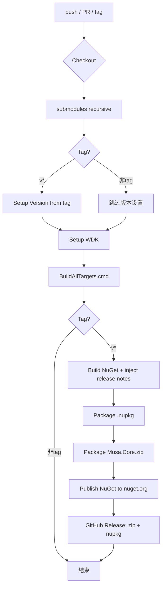

# CI/CD 与部署指南

> [返回目录](./system-architecture.md) ｜ [构建配置](./configuration-guide.md) ｜ [变更日志](./changelog.md)

## CI/CD Pipeline 概览

CI 流水线定义于 `.github/workflows/CI.yaml`，运行于 `windows-2025` runner。

### 触发条件

| 事件 | 范围 |
|---|---|
| push | `main` 分支 |
| pull_request | `main` 分支 |
| push tag | `v*` 格式标签 |

### Pipeline 流程图



## Pipeline 步骤详解

### 1. Checkout

```yaml
- uses: actions/checkout@v4
  with:
    submodules: recursive
```

递归检出所有子模块，确保 `Musa.CoreLite` 和 `Musa.Veil` 依赖可用。

### 2. Setup Version

仅当 `refs/tags/v*` 标签推送时触发：

```powershell
$BuildVersion = "${{ github.ref_name }}".Substring(1)  # 去掉 'v' 前缀
echo "BuildVersion=$BuildVersion" >> $env:GITHUB_ENV
```

提取的版本号写入环境变量，供后续 NuGet 打包使用。

### 3. Setup WDK

WDK 安装脚本执行以下逻辑：

1. **探测 KitsRoot10** — 读取注册表 `HKLM:\SOFTWARE\Microsoft\Windows Kits\Installed Roots`
2. **扫描 SDK 版本** — 枚举 `C:\Program Files (x86)\Windows Kits\10\Include` 下符合 `N.N.N.N` 格式的目录
3. **验证 WDK 组件** — 检查 `km/` 头文件目录和 `WindowsDriver.KernelMode.props`
4. **按需安装** — 若缺失，通过 `winget install Microsoft.WindowsWDK.10.0.{BuildNum}` 安装匹配版本
5. **Post-install Verification** — 重新验证关键路径是否存在

> **注意：** SDK 和 WDK 版本必须匹配（通过 build number 对齐）。

### 4. Build

```cmd
.\BuildAllTargets.cmd
```

调用 `BuildAllTargets.proj`，通过 MSBuild 并行构建全部配置（Debug/Release × x64/ARM64）。

### 5. Build NuGet（仅 tag）

从 git tag 内容提取 release notes，注入 `.nuspec` 的 `<releaseNotes>` 字段：

```powershell
$releaseNotes = git tag -l --format='%(contents)' $env:GITHUB_REF.Remove(0, 10)
# 替换 $releaseNotes$ token → 生成 Musa.Core-New.nuspec
```

### 6. Package

打包 NuGet 和 zip：

```cmd
# NuGet
NuGet pack .\Musa.Core.NuGet\Musa.Core-New.nuspec -Properties version=${{env.BuildVersion}};commit=%GITHUB_SHA%

# Zip
7z a -tzip Musa.Core.zip Publish\
```

### 7. Publish NuGet（仅 tag）

```cmd
NuGet push Musa.Core.${{env.BuildVersion}}.nupkg -ApiKey ${{ secrets.NUGET_TOKEN }} -Source https://api.nuget.org/v3/index.json
```

需要仓库配置 `NUGET_TOKEN` secret。

### 8. GitHub Release（仅 tag）

使用 `softprops/action-gh-release@v2` 发布：

- `Musa.Core.zip` — Publish/ 目录打包
- `*.nupkg` — NuGet 包

## NuGet 包结构

```
Musa.Core.nupkg
├── build/native/
│   ├── Musa.Core.props          # 入口 props，导入 Config 文件
│   ├── Config/
│   │   ├── Musa.Core.Config.props   # 路径解析、Include/Library 设置
│   │   └── Musa.Core.Config.targets # 内核模式校验、/INTEGRITYCHECK
│   └── (Publish/ 内容)
│       ├── Include/             # 公开头文件
│       └── Library/             # 静态库 (按 Config/Platform)
└── nuspec metadata
    ├── id: Musa.Core
    ├── dependency: Musa.CoreLite ≥ 1.1.1
    └── license: MIT
```

### 消费方集成

```xml
<ItemGroup>
  <PackageReference Include="Musa.Core">
    <Version>1.1.1</Version>
  </PackageReference>
</ItemGroup>
```

`Config.props` 自动设置 `IncludePath` 和 `LibraryPath`；`Config.targets` 添加 `/INTEGRITYCHECK` 链接器标志。详见 [构建配置](./configuration-guide.md)。

## 跨平台构建支持

`.github/workflows/EnableX86AndARM.ps1` 用于 CI 环境下的交叉编译支持：

- 修改 `WindowsDriver.common.targets`，移除架构和 OS 版本校验错误
- 使 x86/ARM 交叉编译不被 WDK 内置校验阻止

> 当前构建配置中 x86 已被项目本身排除（`Musa.Core.StaticLibraryForDriver` 不构建 x86），此脚本主要为未来扩展保留。

## Secrets 要求

| Secret | 用途 |
|---|---|
| `NUGET_TOKEN` | NuGet.org 推送认证 |

## 构建产物

| 产物 | 条件 | 内容 |
|---|---|---|
| `Musa.Core.zip` | tag | Publish/ 全量输出 |
| `Musa.Core.*.nupkg` | tag | NuGet 包 |
| GitHub Release | tag | zip + nupkg |
| CI badge | 每次 push | 构建状态 |
