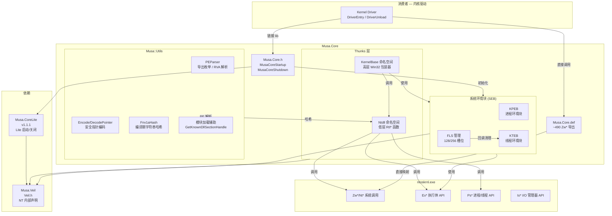
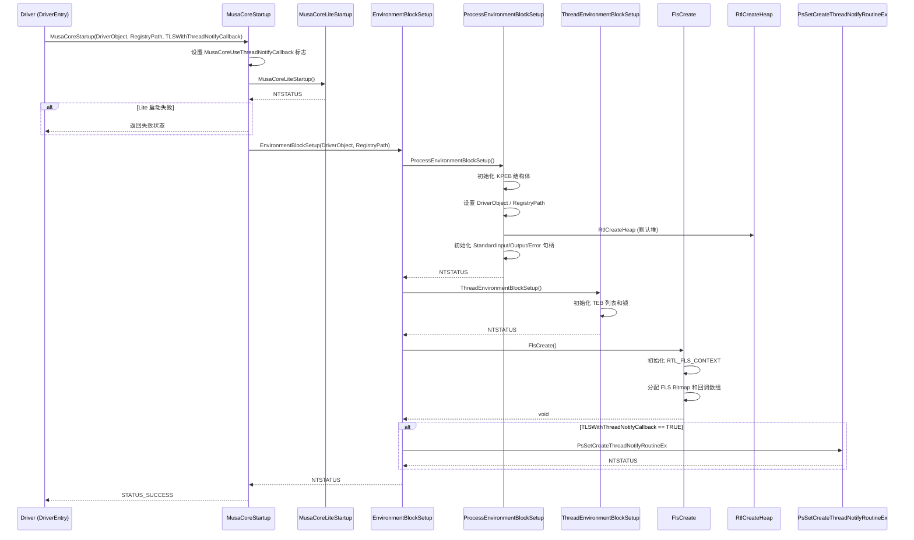
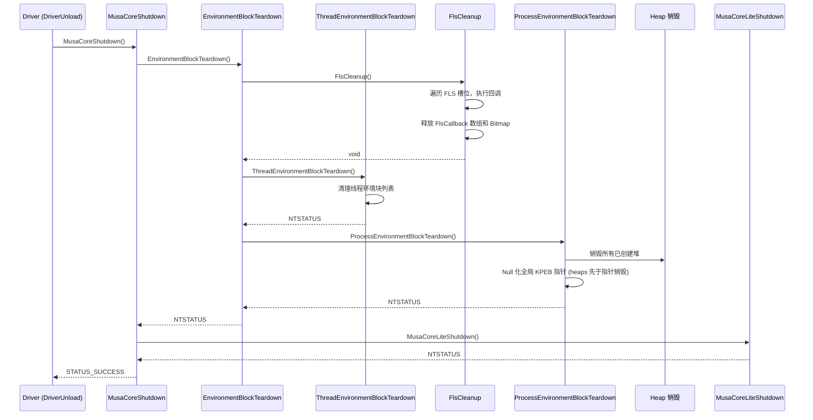
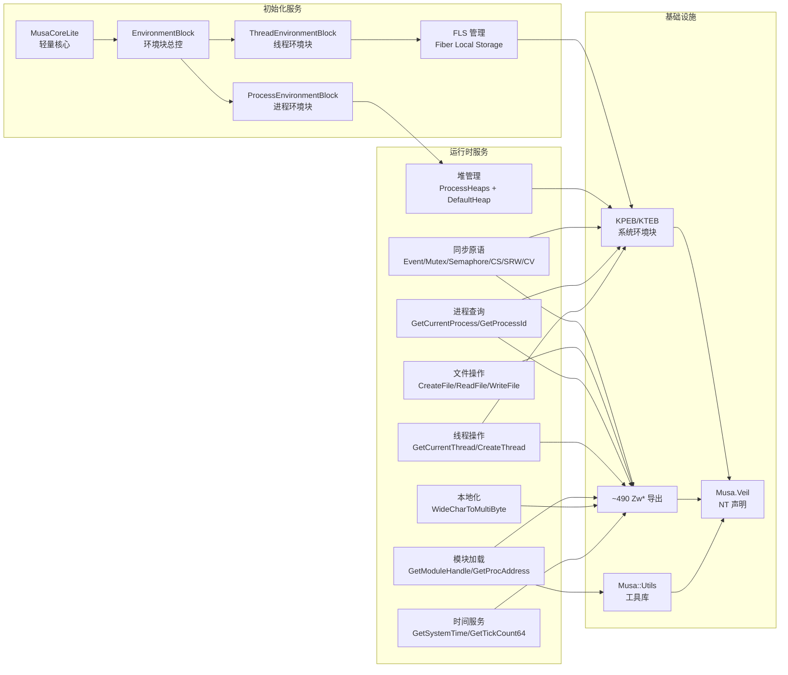
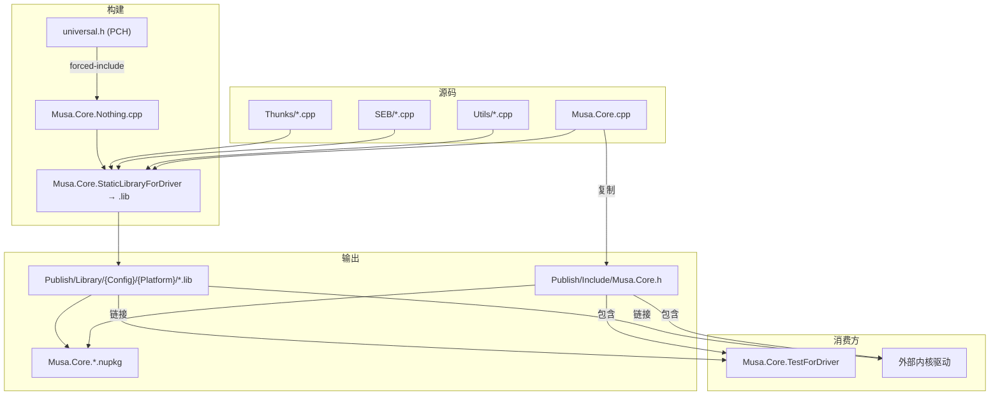

# Musa.Core — 系统架构

## 组件关系图 (Component Relationship)



---

## 数据流图 (Data Flow)

### 启动流程 (Startup Flow)



### 关闭流程 (Shutdown Flow)



---

## 服务依赖图 (Service Dependency)



---

## SEB 架构详解

### KPEB (Kernel Process Environment Block)

```
KPEB (8 字节对齐)
├── ERESOURCE           Lock           # 读写锁 (APC_LEVEL)
├── EX_RUNDOWN_REF      RundownProtect # 关闭保护
├── PDRIVER_OBJECT      DriverObject   # 驱动对象引用
├── UNICODE_STRING      RegistryPath   # 注册表路径
├── SIZE_T              SizeOfImage    # 镜像大小
├── PVOID               ImageBaseAddress
├── UNICODE_STRING      ImagePathName
├── UNICODE_STRING      ImageBaseName
├── ULONG               NumberOfHeaps
├── ULONG               MaximumNumberOfHeaps
├── PVOID               DefaultHeap    # 默认堆 (RtlCreateHeap)
├── PVOID*              ProcessHeaps   # 堆指针数组
├── ULONG               HardErrorMode
├── HANDLE              StandardInput  # 标准输入句柄
├── HANDLE              StandardOutput # 标准输出句柄
├── HANDLE              StandardError  # 标准错误句柄
├── HANDLE              DefaultStandardInput
├── HANDLE              DefaultStandardOutput
├── HANDLE              DefaultStandardError
├── WCHAR               CurrentDirectory[MAX_PATH]
└── PVOID               WaitOnAddressHashTable[128]
```

大小约束：`ALIGN_DOWN(sizeof(KPEB), 8) < PAGE_SIZE`

### KTEB (Kernel Thread Environment Block)

```
KTEB (8 字节对齐)
├── HANDLE              ThreadId        # 线程 ID
├── HANDLE              ProcessId       # 所属进程 ID
├── struct _KPEB*       ProcessEnvironmentBlock  # 指向 KPEB
├── ULONG               HardErrorMode
├── NTSTATUS            ExceptionCode
├── ULONG               LastErrorValue  # GetLastError 存储
├── NTSTATUS            LastStatusValue # RtlGetLastNTError 存储
└── struct _RTL_FLS_DATA* FlsData       # 线程 FLS 数据
```

### FLS (Fiber Local Storage)

```
RTL_FLS_CONTEXT
├── EX_SPIN_LOCK                Lock
├── PFLS_CALLBACK_FUNCTION*     FlsCallback      # 回调函数指针数组
├── LIST_ENTRY                  FlsListHead      # FLS 数据链表头
├── RTL_BITMAP                  FlsBitmap        # 槽位分配位图
├── ULONG                       FlsBitmapBits[]  # 位图数据
└── ULONG                       FlsHighIndex     # 最高使用索引

RTL_FLS_DATA (per-thread)
├── LIST_ENTRY  Entry           # 链表节点
└── PVOID       Slots[]         # 槽位数组 (x64: 128 槽位)
```

FLS 容量：`RTLP_FLS_MAXIMUM_AVAILABLE = 256 - (sizeof(LIST_ENTRY) / sizeof(PVOID))`
- x64：128 槽位
- x86：254 槽位

---

## Thunk 实现模式

每个 Thunk 函数遵循统一的结构模式：

```
#include "Internal/模块.h"          ← 私有头文件
#pragma alloc_text(PAGE, MUSA_NAME(Fn))   ← PAGE 段注解
EXTERN_C_START                      ← C 链接开始

NTSTATUS MUSA_NAME(Fn)(参数) {      ← SAL 注解的函数签名
    PAGED_CODE();                   ← 分页检查

    // NTSTATUS 内核实现...

    return BaseSetLastNTError(Status);  ← 设置 LastError 并返回
}

MUSA_IAT_SYMBOL(Fn, stack_bytes)    ← IAT 符号注册
EXTERN_C_END                        ← C 链接结束
```

命名约定：
- `MUSA_NAME(name)` → `_Musa_name`（公开符号）
- `MUSA_NAME_PRIVATE(name)` → `_Musa_Private_name`（内部符号）
- x86：`MUSA_IAT_SYMBOL(name, stack)` 生成 `name@stack` 修饰符
- x64/ARM64：直接符号名

---

## 构建依赖链



## 相关文档

- [项目概述 (PDR)](project-overview-pdr.md) — 目的、设计、路线图
- [代码库摘要](codebase-summary.md) — 完整文件清单和依赖
